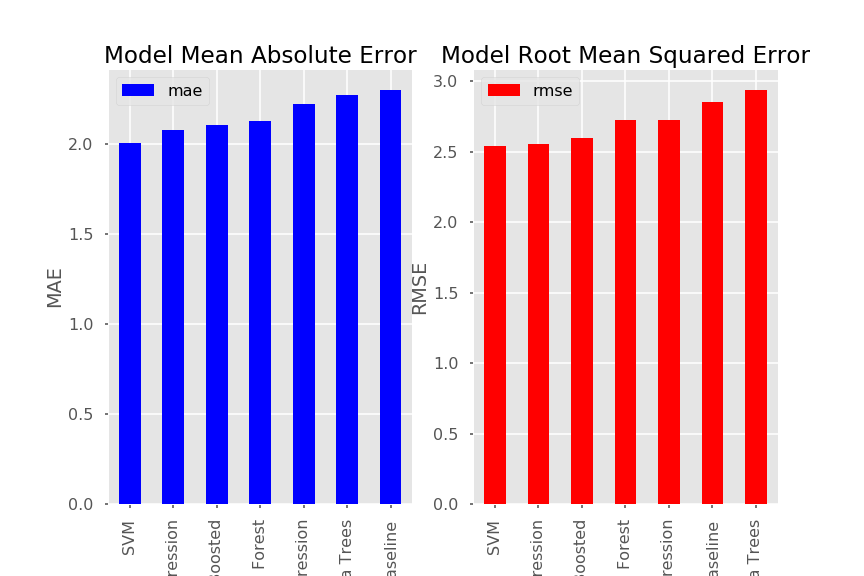

# StudentOutcomePredictor

Predicting a Portuguese secondary-school student's final grade from survey answers, with six scikit-learn regressors and a Bayesian linear regression in PyMC3.

The data is the [UCI Student Performance dataset](https://archive.ics.uci.edu/ml/datasets/student+performance) from [Cortez and Silva, 2008](http://www3.dsi.uminho.pt/pcortez/student.pdf).
It covers students in a math class and a Portuguese class at two schools.
The raw files and the attribute descriptions are in `Data/Raw/`.

## Results

Every number below is copied from a saved output in `FinalDraftStudentOutcome.ipynb`.
Cell numbers count every cell in file order, starting at 0.

### Data

The notebook stacks `student-mat.csv` and `student-por.csv` and drops students whose final grade is 0 or 1.
That leaves 990 rows and 33 columns (cell 12).
Final grades in the cleaned data run from 4 to 20 (cell 10).
The notebook renames the final grade `G3` to `Grade`.

The 50th percentile grade is 12, and 16 is the lowest grade above the 90th percentile (cell 43).

These features correlate with the final grade at 0.17 or more in magnitude, with the period grades `G1` and `G2` excluded (cell 25):

| Feature | Correlation |
| --- | --- |
| failures (past class failures) | -0.347 |
| absences | -0.223 |
| Walc (weekend alcohol use) | -0.184 |
| Dalc (weekday alcohol use) | -0.172 |
| Medu (mother's education) | 0.225 |
| studytime | 0.191 |
| Fedu (father's education) | 0.172 |

### Models

The models use the features most correlated with the grade after one-hot encoding (cells 48 and 49).
Those are failures, mother's education, absences, study time, weekend alcohol use and weekday alcohol use.
`G1`, `G2` and the school are dropped before the selection, because the period grades would give the answer away.
`format_data` in cell 48 also splits off a held-out test set with `train_test_split`.

Test-set error for each model (cell 76):

| Model | MAE | RMSE |
| --- | --- | --- |
| SVM (RBF kernel) | 2.003 | 2.540 |
| Linear Regression | 2.073 | 2.555 |
| Gradient Boosted | 2.103 | 2.599 |
| Random Forest | 2.126 | 2.726 |
| Bayesian LR | 2.166 | 2.670 |
| ElasticNet Regression | 2.218 | 2.730 |
| Extra Trees | 2.272 | 2.940 |
| Median baseline | 2.298 | 2.855 |

The SVM has an MAE 12.85% lower than the median baseline (cell 63).
Even the best model misses by about two grade points on average, so these six survey features explain only part of a student's final grade.

Cell 61 saved this figure.
It plots the six scikit-learn models and the baseline, without the Bayesian model.

### Bayesian linear regression

The PyMC3 model fits the same six features by MCMC sampling (cell 66).
Posterior means and 95% highest-posterior-density intervals (cell 72):

| Term | Mean | 95% HPD |
| --- | --- | --- |
| Intercept | 11.26 | 10.50 to 12.02 |
| failures | -1.28 | -1.59 to -0.97 |
| mother_edu | 0.42 | 0.25 to 0.58 |
| studytime | 0.41 | 0.19 to 0.65 |
| absences | -0.077 | -0.110 to -0.045 |
| Walc | -0.18 | -0.36 to 0.01 |
| Dalc | -0.04 | -0.31 to 0.24 |

Past class failures carry the largest weight, at -1.28 grade points per failure.
The intervals for weekend and weekday alcohol use both include zero, so this data does not pin down their effect.
Every Rhat value falls between 0.9998 and 1.0022 (cell 72).

## Keras

The Keras experiments did not produce a usable result: the Keras cells in `EDA.ipynb`, `FinalDraftStudentOutcome.ipynb`, `RoughDraft3.ipynb` and `RoughDraft4.ipynb` all end in errors while importing Keras, and the feature matrix that `KerasModels.ipynb` builds in cell 15 still contains the target `G3`, so its near-zero cross-validated MSE (cells 23 to 28) points to target leakage rather than a working model.
The notebooks stay in the repo as a record of the attempt.

## Repository layout

| Path | Contents |
| --- | --- |
| `FinalDraftStudentOutcome.ipynb` | The full analysis and the source for every number above |
| `EDA.ipynb` | An earlier copy of the same analysis |
| `RoughDraft3.ipynb`, `RoughDraft4.ipynb` | Earlier drafts |
| `KerasModels.ipynb` | The Keras regression attempt described above |
| `Data/Raw/` | The UCI CSVs, the attribute descriptions and the dataset's R merge script |
| `Data/Processed/combined_raw.csv` | The two CSVs stacked, as written by the notebooks |
| `Output/` | Saved figures and the presentation deck |

## Limits

- The notebooks ran on old library releases; the saved output paths show Python 3.7. They call `DataFrame.ix`, `pm.glm` and `pm.GLM.from_formula`, which current pandas and PyMC have removed, so they will not run unmodified today. The repo has no requirements file.
- `FinalDraftStudentOutcome.ipynb` was not saved from a clean top-to-bottom run. Cells 30, 34, 52, 54 and 56 have no execution count, so the saved outputs come from an earlier kernel state.
- Stacking the math and Portuguese files counts a student who took both classes twice. `Data/Raw/student.txt` describes the overlap, and `Data/Raw/student-merge.R` shows how to find it. The notebooks do not remove it, so the same student can land in both the training and the test set.
- The notebooks write their figures to the repo root when they run; the committed copies live in `Output/`.
- There is no test suite and no CI.
